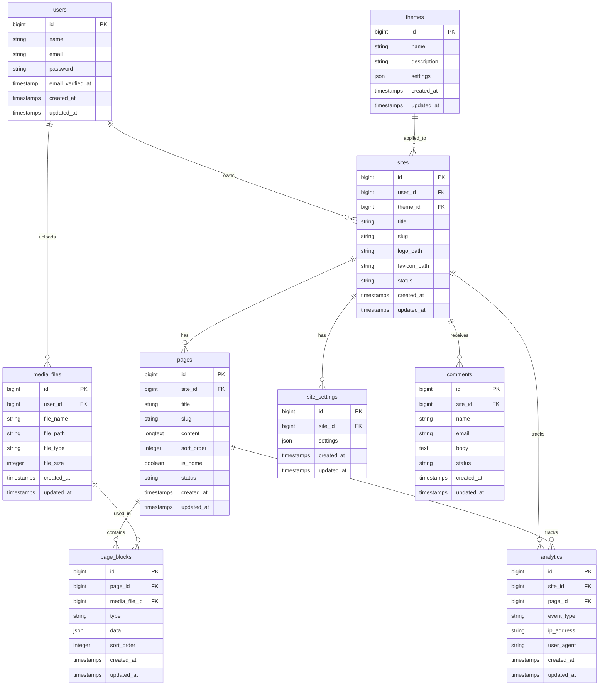

# Database Design

## 目的

本ドキュメントは、卒業研究で作成するWebサイト作成アプリのデータベース設計をまとめる。

本アプリでは、ユーザーがログインし、サイトを作成し、ページ・画像・テーマ・公開状態などを管理できるようにする。

---

# 使用DB

開発環境では SQLite または MySQL を使用する。
本番環境では Render で利用可能な PostgreSQL を想定する。

---

# ER図



---

# テーブル設計

## users

Laravel Breezeで作成されるユーザーテーブル。
ログイン、登録、プロフィール管理に使用する。

| カラム名              | 型         | 内容      |
| ----------------- | --------- | ------- |
| id                | bigint    | ユーザーID  |
| name              | string    | ユーザー名   |
| email             | string    | メールアドレス |
| password          | string    | パスワード   |
| email_verified_at | timestamp | メール認証日時 |
| created_at        | timestamp | 作成日時    |
| updated_at        | timestamp | 更新日時    |

---

## sites

ユーザーが作成するWebサイトを管理するテーブル。

| カラム名         | 型         | 内容                |
| ------------ | --------- | ----------------- |
| id           | bigint    | サイトID             |
| user_id      | bigint    | 作成者ID             |
| theme_id     | bigint    | 使用テーマID           |
| title        | string    | サイトタイトル           |
| slug         | string    | URL用の名前           |
| logo_path    | string    | ロゴ画像パス            |
| favicon_path | string    | サイトアイコンパス         |
| status       | string    | draft / published |
| created_at   | timestamp | 作成日時              |
| updated_at   | timestamp | 更新日時              |

---

## pages

サイト内の各ページを管理するテーブル。

| カラム名       | 型         | 内容                |
| ---------- | --------- | ----------------- |
| id         | bigint    | ページID             |
| site_id    | bigint    | 所属サイトID           |
| title      | string    | ページタイトル           |
| slug       | string    | URL用の名前           |
| content    | longtext  | ページ内容             |
| sort_order | integer   | 表示順               |
| is_home    | boolean   | トップページかどうか        |
| status     | string    | draft / published |
| created_at | timestamp | 作成日時              |
| updated_at | timestamp | 更新日時              |

---

## page_blocks

ページ内の段落・画像・動画・テーブルなどをブロック単位で管理するテーブル。

| カラム名          | 型         | 内容                                  |
| ------------- | --------- | ----------------------------------- |
| id            | bigint    | ブロックID                              |
| page_id       | bigint    | 所属ページID                             |
| media_file_id | bigint    | 使用メディアID                            |
| type          | string    | text / image / video / table / link |
| data          | json      | ブロック内容                              |
| sort_order    | integer   | 表示順                                 |
| created_at    | timestamp | 作成日時                                |
| updated_at    | timestamp | 更新日時                                |

---

## media_files

画像・動画・音声・ファイルなどのアップロード情報を管理するテーブル。

| カラム名       | 型         | 内容                           |
| ---------- | --------- | ---------------------------- |
| id         | bigint    | メディアID                       |
| user_id    | bigint    | アップロードしたユーザーID               |
| file_name  | string    | ファイル名                        |
| file_path  | string    | 保存先パス                        |
| file_type  | string    | image / video / audio / file |
| file_size  | integer   | ファイルサイズ                      |
| created_at | timestamp | 作成日時                         |
| updated_at | timestamp | 更新日時                         |

---

## themes

サイトテーマを管理するテーブル。

| カラム名        | 型         | 内容          |
| ----------- | --------- | ----------- |
| id          | bigint    | テーマID       |
| name        | string    | テーマ名        |
| description | string    | テーマ説明       |
| settings    | json      | 色・フォントなどの設定 |
| created_at  | timestamp | 作成日時        |
| updated_at  | timestamp | 更新日時        |

---

## site_settings

サイトごとの詳細設定を管理するテーブル。

| カラム名       | 型         | 内容    |
| ---------- | --------- | ----- |
| id         | bigint    | 設定ID  |
| site_id    | bigint    | サイトID |
| settings   | json      | サイト設定 |
| created_at | timestamp | 作成日時  |
| updated_at | timestamp | 更新日時  |

---

## comments

公開サイトに対するコメント・フィードバックを管理するテーブル。

| カラム名       | 型         | 内容               |
| ---------- | --------- | ---------------- |
| id         | bigint    | コメントID           |
| site_id    | bigint    | 対象サイトID          |
| name       | string    | 投稿者名             |
| email      | string    | 投稿者メール           |
| body       | text      | コメント本文           |
| status     | string    | visible / hidden |
| created_at | timestamp | 作成日時             |
| updated_at | timestamp | 更新日時             |

---

## analytics

閲覧数やページ遷移などの統計情報を管理するテーブル。

| カラム名       | 型         | 内容                  |
| ---------- | --------- | ------------------- |
| id         | bigint    | 統計ID                |
| site_id    | bigint    | サイトID               |
| page_id    | bigint    | ページID               |
| event_type | string    | view / click / jump |
| ip_address | string    | IPアドレス              |
| user_agent | string    | ブラウザ情報              |
| created_at | timestamp | 作成日時                |
| updated_at | timestamp | 更新日時                |

---

# 最初に作成するテーブル

6月時点では、以下のテーブルから作成する。

```text
users
sites
pages
page_blocks
media_files
themes
```

以下は後回しにする。

```text
comments
analytics
site_settings
```

---

# 作成しない機能

卒研の初期段階では、以下の機能はDB設計のみ残し、実装は後回しにする。

```text
クレジットカード支払い
予約フォーム
高度なアクセス解析
ストーリー機能
スライドショー
コメント承認機能
```

---

# migration作成順

```bash
php artisan make:migration create_themes_table
php artisan make:migration create_sites_table
php artisan make:migration create_pages_table
php artisan make:migration create_page_blocks_table
php artisan make:migration create_media_files_table
php artisan make:migration create_site_settings_table
php artisan make:migration create_comments_table
php artisan make:migration create_analytics_table
```

usersテーブルはLaravel Breeze導入時点で作成済みのため、新規作成しない。

---

# 注意点

* usersテーブルはLaravel Breezeの標準構成を使う
* sitesは必ずusersに紐づける
* pagesは必ずsitesに紐づける
* page_blocksはページ編集機能の中心になる
* media_filesは画像・動画・音声・ファイルをまとめて管理する
* commentsとanalyticsは後半の発展機能として扱う
* migrationを追加・変更する場合は必ずチームに共有する
